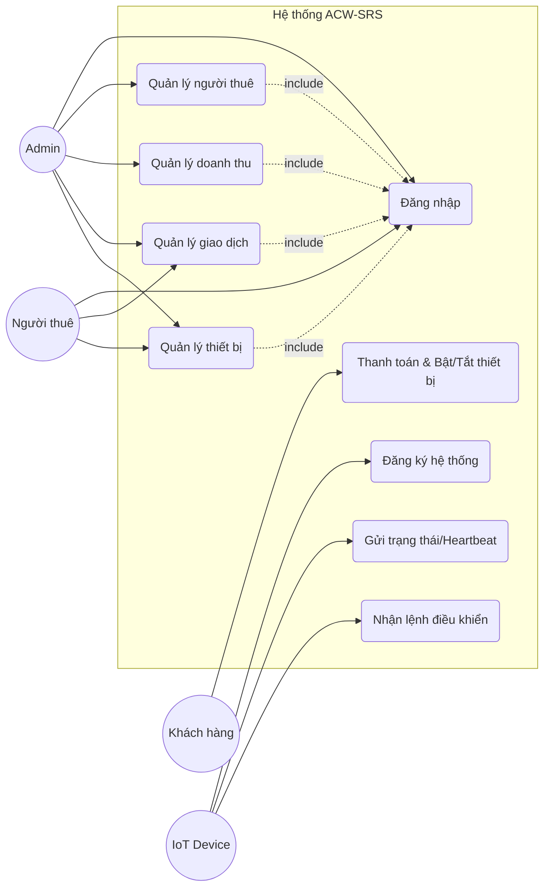

# ACW-SRS — Auto Car Wash Smart Rental System

## Giới thiệu
ACW-SRS là nền tảng quản lý trạm rửa xe tự động theo mô hình SaaS/Multi-tenant. Hệ thống kết nối thiết bị ESP32 với web dashboard để giám sát thiết bị, quản lý doanh thu, giao dịch và vận hành nhiều tenant trên cùng một hệ thống. README này được cập nhật dựa trên code hiện có trong dự án.

## Gợi ý tên đồ án (dựa trên chức năng thực tế)
- **AutoWash Cloud**
- **SmartWash SaaS**
- **ACW-SRS (Auto Car Wash – Smart Rental System)**
- **Multi-Tenant Smart Car Wash Platform**

## Phân tích Use Case hệ thống

Dưới đây là sơ đồ Use Case tổng quát của hệ thống ACW-SRS, thể hiện mối tương quan giữa các tác nhân (Actors) và các chức năng chính.



### Chi tiết các tác nhân (Actors)

*   **Admin (Super Admin)**:
    *   **Quản lý người thuê**: Thực hiện các quyền CRUD (Thêm, Sửa, Xóa, Xem) đối với các Tenant.
    *   **Quản lý doanh thu**: Xem tổng doanh thu hệ thống và gửi báo cáo doanh thu.
    *   **Quản lý giao dịch**: Xem danh sách giao dịch toàn hệ thống và xuất file thống kê.
    *   **Quản lý thiết bị**: Theo dõi và cấu hình toàn bộ thiết bị trong hệ thống.

*   **Người thuê (Tenant Admin)**:
    *   **Quản lý giao dịch**: Theo dõi và xuất số liệu giao dịch thuộc phạm vi các trạm mình quản lý.
    *   **Quản lý thiết bị**: Trực tiếp quản lý (thêm/sửa/xóa/cấu hình) các thiết bị rửa xe tại trạm.
    *   **Đăng nhập**: Truy cập portal dành riêng cho người thuê.

*   **Khách hàng (Customer)**:
    *   **Thanh toán & Bật/Tắt thiết bị**: Thực hiện thanh toán qua QR và kích hoạt thiết bị để sử dụng dịch vụ.

*   **Thiết bị IoT (ESP32)**:
    *   **Đăng ký hệ thống**: Tự động kết nối và đăng ký định danh khi khởi động.
    *   **Gửi trạng thái**: Gửi dữ liệu heartbeat và trạng thái hoạt động thực tế về server.
    *   **Nhận lệnh điều khiển**: Tiếp nhận và thực thi các lệnh vận hành (Bật/Tắt) từ người dùng thông qua server.

## Chức năng hiện có trong mã nguồn (API & Dashboard)

## Kiến trúc & Công nghệ
- **Frontend**: Next.js App Router + TailwindCSS + shadcn/ui
- **Backend**: API Routes trong Next.js
- **Database**: MySQL
- **Auth**: JWT + middleware
- **Thanh toán**: mock/sepay (`lib/payment`)
- **IoT**: ESP32, giao tiếp qua HTTP API (có endpoint riêng)

## Cấu trúc dự án (tóm tắt)
```
app/                  # Next.js App Router
  (auth)/             # Login/Register
  api/                # API routes
  super-admin/        # Dashboard Super Admin
  tenant/             # Dashboard Tenant
components/           # UI Components
lib/                  # Auth, DB, Payment, Utilities
public/               # Static assets
```

## Hướng dẫn cài đặt
### Yêu cầu
- Node.js 18+
- npm hoặc yarn
- MySQL 8.0+

### Chạy dự án
1. Cài dependencies:
```
npm install
```

2. Tạo file `.env.local`:
```
cp env.example .env.local
```

3. Chạy dev server:
```
npm run dev
```

4. Truy cập:
```
http://localhost:3000
```

## Lộ trình phát triển (gợi ý dựa trên code hiện tại)
- **Phase 1:** Hoàn thiện core dashboard (Super Admin, Tenant)
- **Phase 2:** Hoàn thiện IoT API + quản lý thiết bị
- **Phase 3:** Hoàn thiện billing, leads/orders, analytics
- **Phase 4:** Tối ưu vận hành, bảo mật, mở rộng tenant

## Tác giả
- (Điền tên sinh viên/nhóm thực hiện)
- (Thông tin liên hệ)

## Giấy phép
- (Điền giấy phép nếu cần, ví dụ: MIT)
