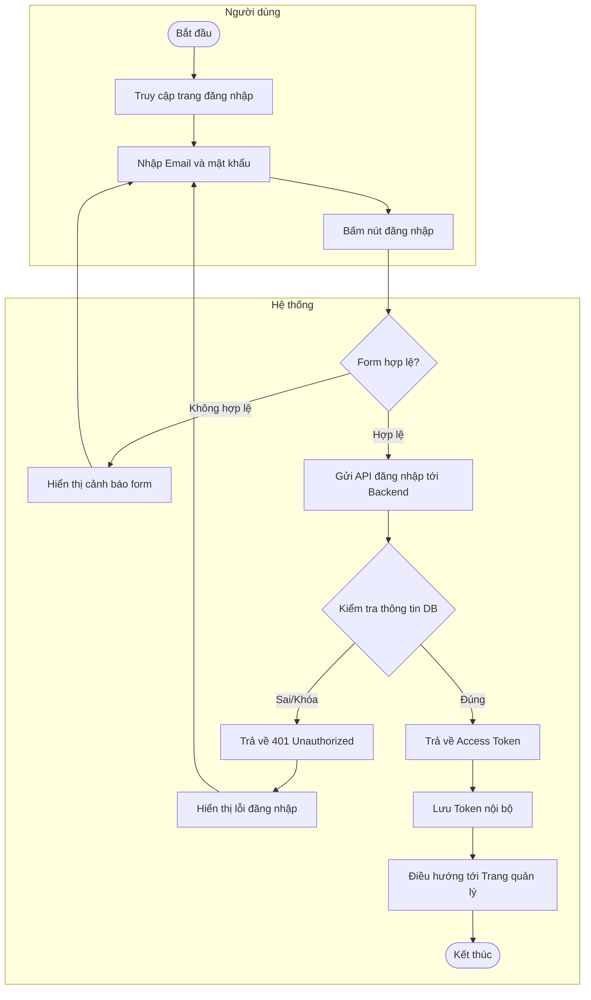
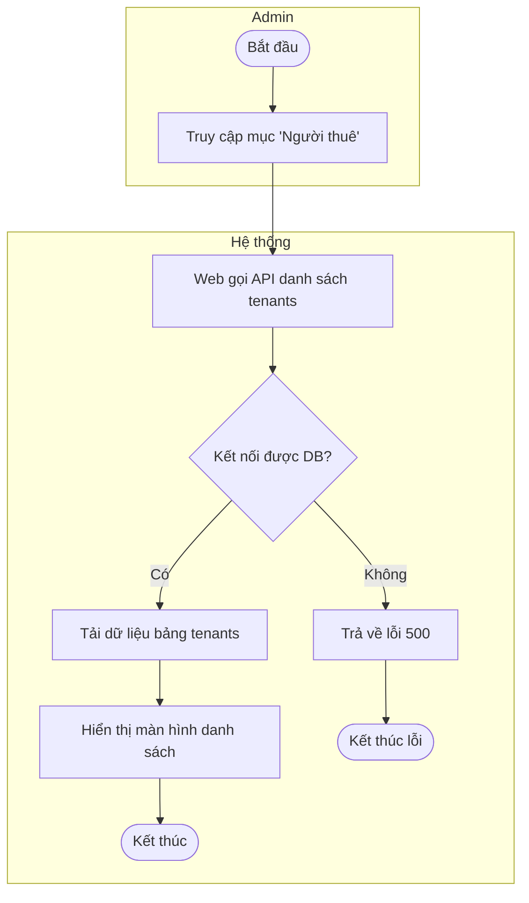
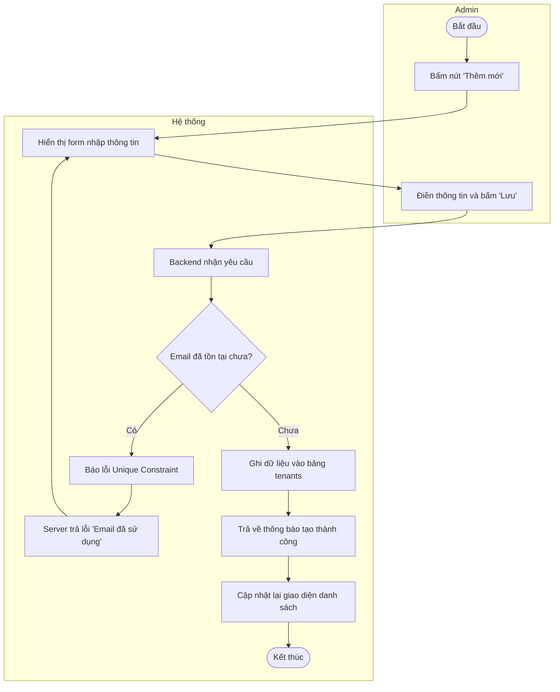
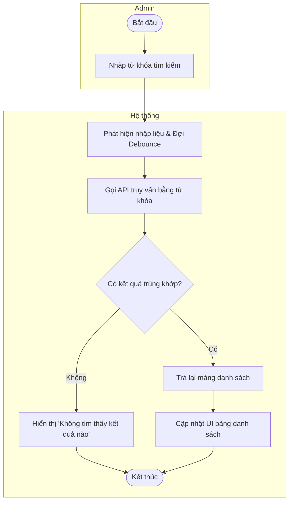
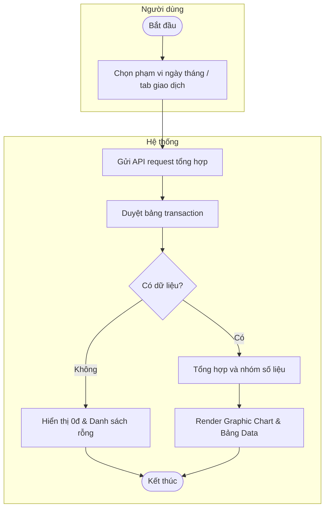
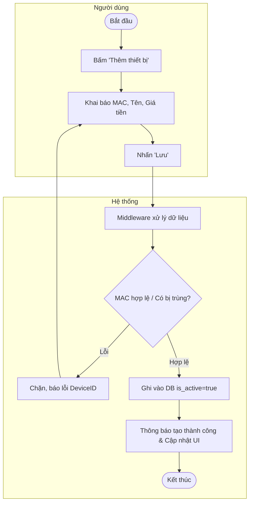
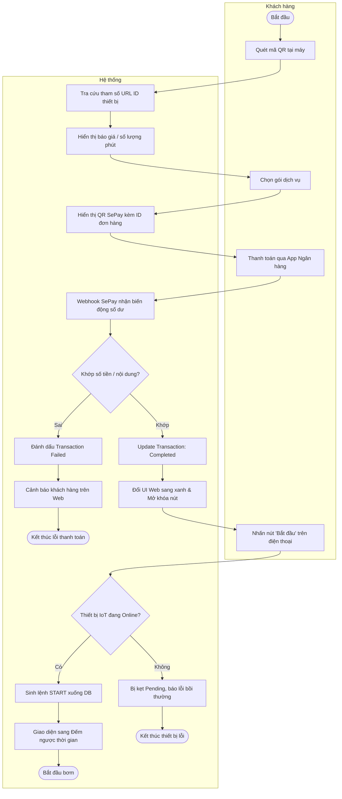
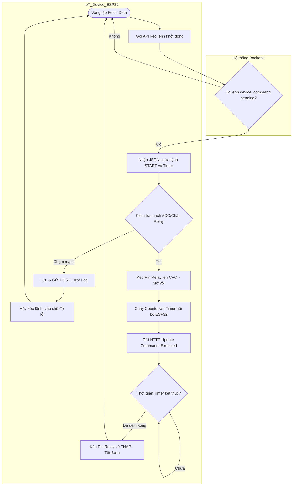

# Biểu đồ Hoạt động (Activity Diagrams) - Hệ thống ACW-SRS

Tài liệu này cung cấp biểu đồ hoạt động dạng flowchart có **chia luồng (Swimlanes)** để phân định rõ ràng các thao tác của **Người dùng (Actor)** và **Hệ thống (Web/Backend/Database)**.

---

## 1. NHÓM XÁC THỰC

### UC-1.1: Đăng nhập

---

## 2. NHÓM QUẢN LÝ NGƯỜI THUÊ (DÀNH CHO ADMIN)

### UC-2.1: Quản lý người thuê (Tổng quát)

### UC-2.3: Thêm người thuê

### UC-2.6: Tìm kiếm người thuê

---

## 3. NHÓM QUẢN LÝ DOANH THU & GIAO DỊCH

### UC-3.1 & UC-4.1: Xem Doanh thu / Giao dịch

---

## 5. NHÓM QUẢN LÝ THIẾT BỊ

### UC-5.2: Thêm thiết bị tĩnh

---

## 6. NHÓM CHỨC NĂNG KHÁCH HÀNG

### UC-6.1: Thanh toán và Khởi động thiết bị tự động

---

## 7. NHÓM CHỨC NĂNG IOT DEVICE (ESP32)

### UC-7.3: Gọi lệnh thực thi
