# Biểu đồ Hoạt động - ACW-SRS

---

## UC-1.1: Đăng nhập

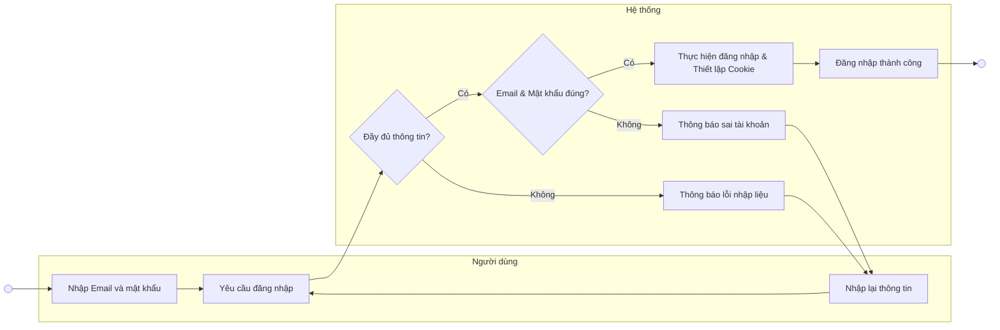

---

## UC-2.2: Xem thông tin người thuê

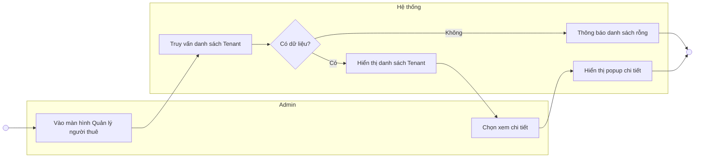

---

## UC-2.3: Thêm người thuê

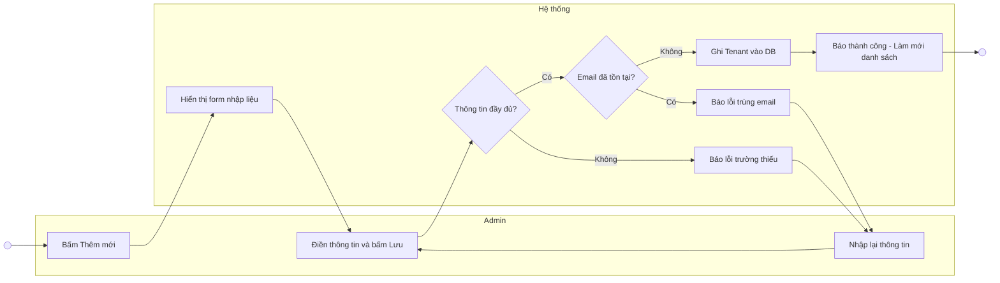

---

## UC-2.4: Sửa người thuê

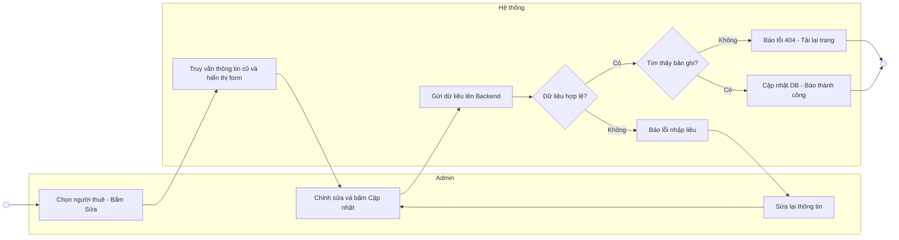

---

## UC-2.5: Xóa người thuê

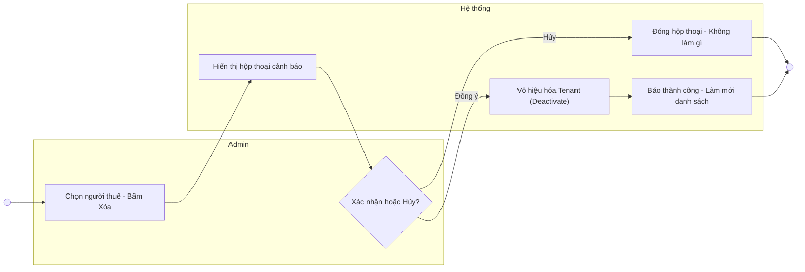

---

## UC-2.6: Tìm kiếm người thuê

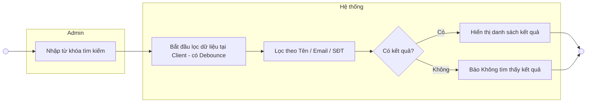

---

## UC-3.2: Xem doanh thu

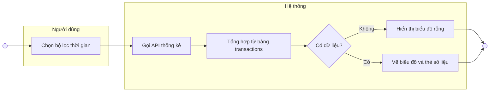

---

## UC-3.3: Gửi báo cáo doanh thu

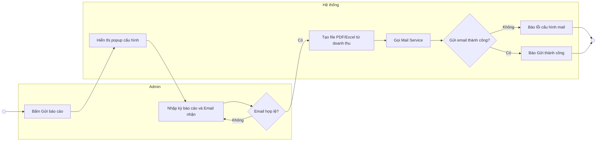

---

## UC-4.2: Xem giao dịch

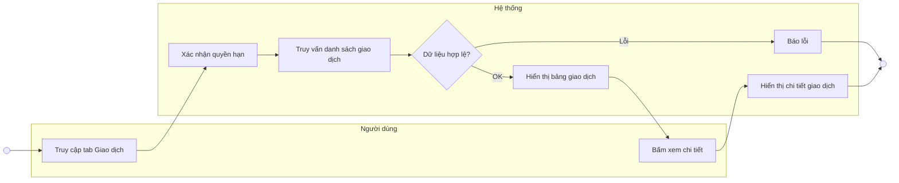

---

## UC-4.3: Xuất file thống kê

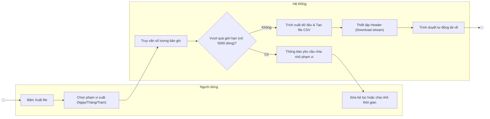

---

## UC-5.2: Xem thiết bị

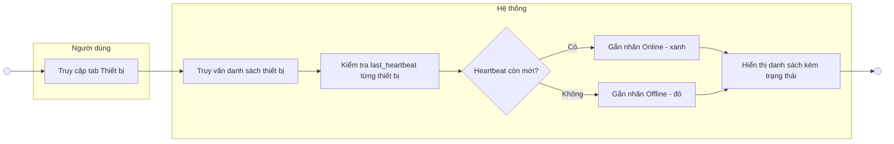

---

## UC-5.3: Thêm thiết bị

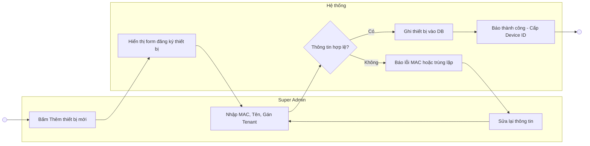

---

## UC-5.4: Sửa cấu hình thiết bị

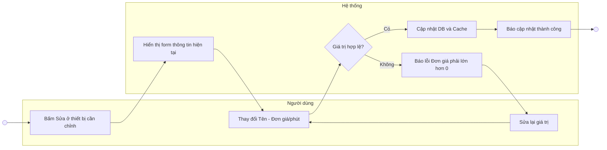

---

## UC-5.5: Xóa thiết bị

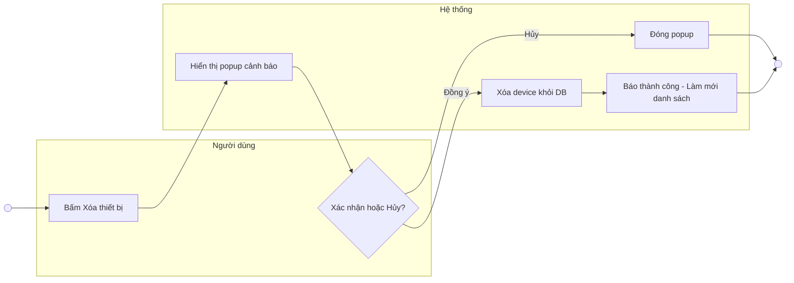

---

### UC-6.1: Thanh toán và Khởi động máy
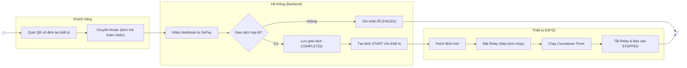

---

## UC-7.1: Đăng ký hệ thống (ESP32)

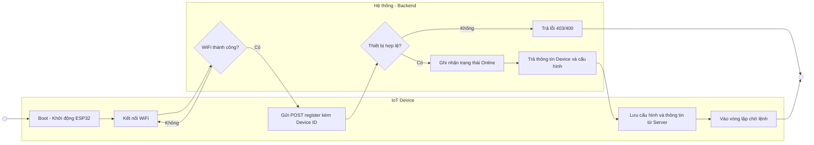

---

## UC-7.2: Gửi trạng thái (Heartbeat)

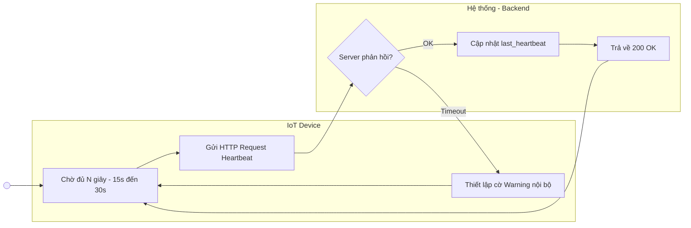

---

## UC-7.3: Nhận lệnh điều khiển (ESP32)

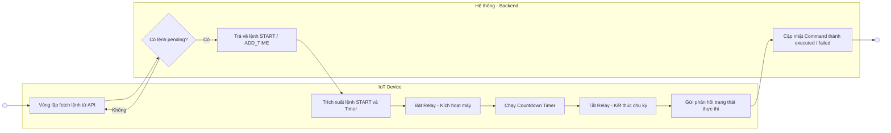
