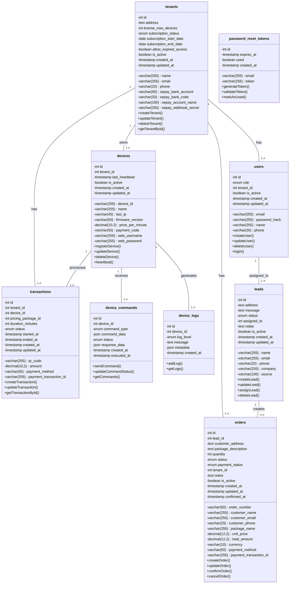

```mermaid
classDiagram
    class tenants {
        -int id
        -varchar(255) name
        -varchar(255) email
        -varchar(20) phone
        -text address
        -int license_max_devices
        -enum subscription_status
        -date subscription_start_date
        -date subscription_end_date
        -boolean allow_expired_access
        -boolean is_active
        -varchar(50) sepay_bank_account
        -varchar(20) sepay_bank_code
        -varchar(100) sepay_account_name
        -varchar(255) sepay_webhook_secret
        -timestamp created_at
        -timestamp updated_at
        +createTenant()
        +updateTenant()
        +deleteTenant()
        +getTenantById()
    }

    class users {
        -int id
        -varchar(255) email
        -varchar(255) password_hash
        -enum role
        -int tenant_id
        -varchar(255) name
        -varchar(20) phone
        -boolean is_active
        -timestamp created_at
        -timestamp updated_at
        +createUser()
        +updateUser()
        +deleteUser()
        +login()
    }

    class devices {
        -int id
        -int tenant_id
        -varchar(255) device_id
        -varchar(255) name
        -timestamp last_heartbeat
        -varchar(45) last_ip
        -varchar(50) firmware_version
        -boolean is_active
        -decimal(10,2) price_per_minute
        -varchar(50) payment_code
        -varchar(255) web_username
        -varchar(255) web_password
        -timestamp created_at
        -timestamp updated_at
        +registerDevice()
        +updateDevice()
        +deleteDevice()
        +heartbeat()
    }

    class transactions {
        -int id
        -int tenant_id
        -int device_id
        -int pricing_package_id
        -varchar(255) qr_code
        -decimal(10,2) amount
        -int duration_minutes
        -enum status
        -varchar(50) payment_method
        -varchar(255) payment_transaction_id
        -timestamp started_at
        -timestamp ended_at
        -timestamp created_at
        -timestamp updated_at
        +createTransaction()
        +updateTransaction()
        +getTransactionById()
    }

    class device_commands {
        -int id
        -int device_id
        -enum command_type
        -json command_data
        -enum status
        -json response_data
        -timestamp created_at
        -timestamp executed_at
        +sendCommand()
        +updateCommandStatus()
        +getCommands()
    }

    class device_logs {
        -int id
        -int device_id
        -enum log_level
        -text message
        -json metadata
        -timestamp created_at
        +addLog()
        +getLogs()
    }

    class leads {
        -int id
        -varchar(255) name
        -varchar(255) email
        -varchar(20) phone
        -varchar(255) company
        -text address
        -text message
        -varchar(100) source
        -enum status
        -int assigned_to
        -text notes
        -boolean is_active
        -timestamp created_at
        -timestamp updated_at
        +createLead()
        +updateLead()
        +assignLead()
        +deleteLead()
    }

    class orders {
        -int id
        -int lead_id
        -varchar(50) order_number
        -varchar(255) customer_name
        -varchar(255) customer_email
        -varchar(20) customer_phone
        -text customer_address
        -varchar(255) package_name
        -text package_description
        -int quantity
        -decimal(12,2) unit_price
        -decimal(12,2) total_amount
        -varchar(10) currency
        -enum status
        -enum payment_status
        -varchar(50) payment_method
        -varchar(255) payment_transaction_id
        -int tenant_id
        -text notes
        -boolean is_active
        -timestamp created_at
        -timestamp updated_at
        -timestamp confirmed_at
        +createOrder()
        +updateOrder()
        +confirmOrder()
        +cancelOrder()
    }

    class password_reset_tokens {
        -int id
        -varchar(255) email
        -varchar(255) token
        -timestamp expires_at
        -boolean used
        -timestamp created_at
        +generateToken()
        +validateToken()
        +markAsUsed()
    }

    tenants "1" -- "1..n" users : has
    tenants "1" -- "1..n" devices : owns
    tenants "1" -- "1..n" transactions : has
    tenants "1" -- "1..n" orders : has
    users "1" -- "1..n" leads : assigned_to
    devices "1" -- "1..n" transactions : processes
    devices "1" -- "1..n" device_commands : receives
    devices "1" -- "1..n" device_logs : generates
    leads "1" -- "1..n" orders : creates
```
