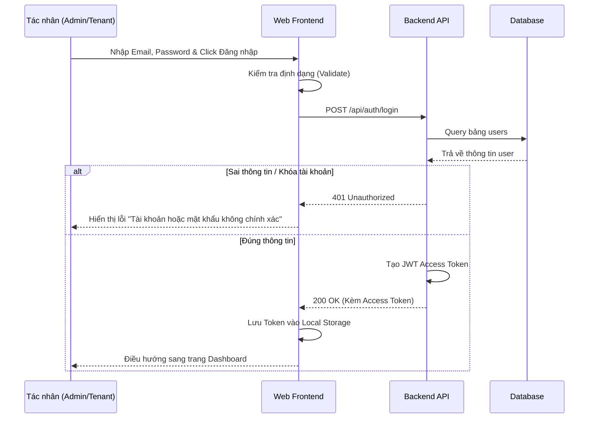
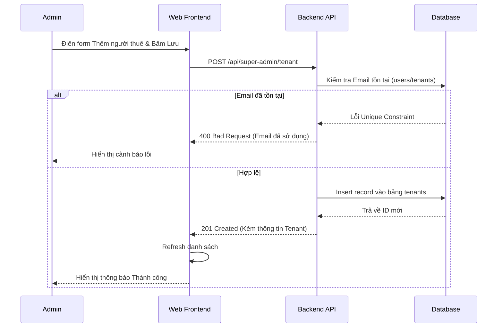
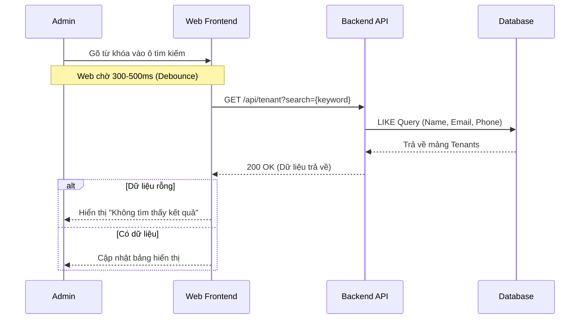
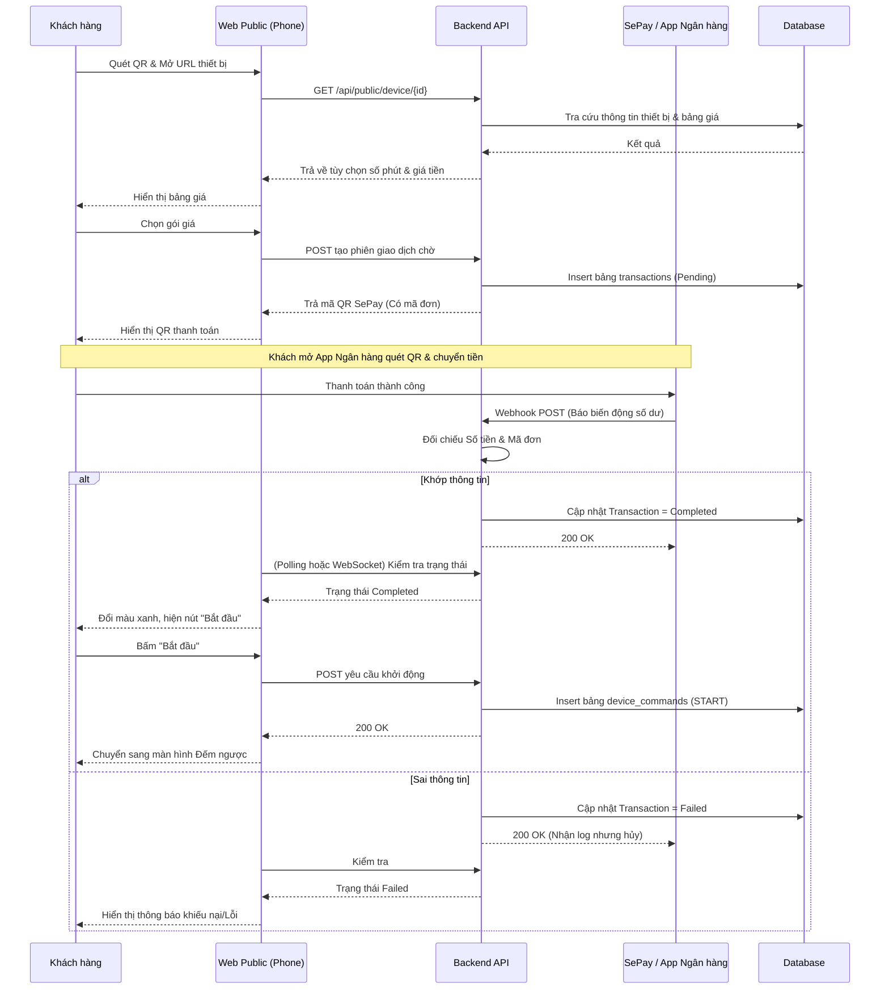
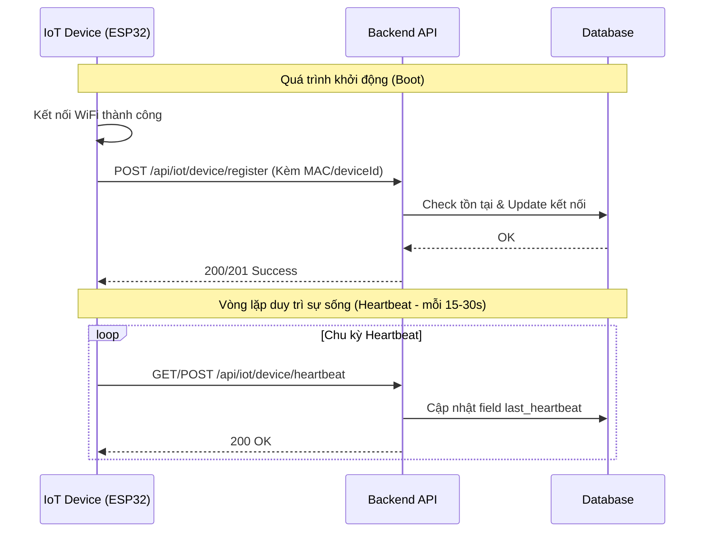
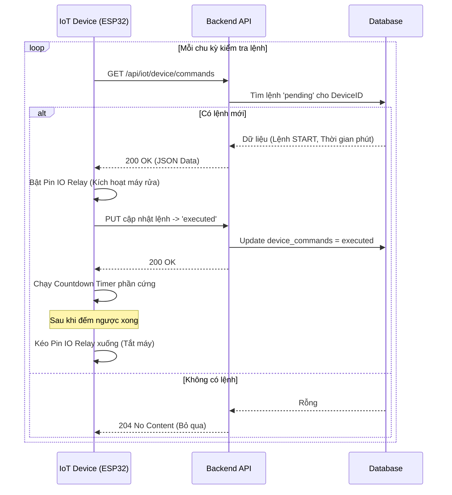
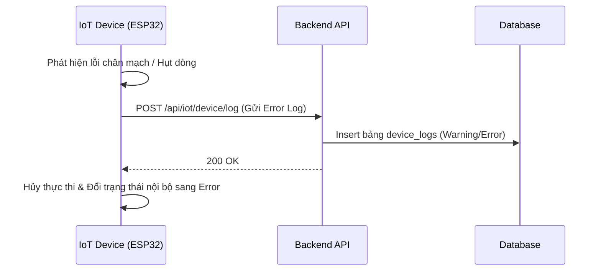

# Biểu đồ Trình tự (Sequence Diagrams) - Hệ thống ACW-SRS

Tài liệu này cung cấp các biểu đồ trình tự (Sequence Diagram) mô tả luồng tương tác giữa các thực thể (Người dùng, Frontend, API, Database, Hệ thống ngoài) của nền tảng dựa trên đặc tả hệ thống.

---

## 1. NHÓM XÁC THỰC

### UC-1.1: Đăng nhập

---

## 2. NHÓM QUẢN LÝ NGƯỜI THUÊ (DÀNH CHO ADMIN)

### UC-2.3: Thêm người thuê (Tương tự cho các thao tác Thêm/Sửa/Xóa)

### UC-2.6: Tìm kiếm người thuê (Debounce Search)

---

## 3. NHÓM KHÁCH HÀNG & THANH TOÁN

### UC-6.1: Thanh toán và Khởi động thiết bị tự động (Luồng quan trọng nhất)

---

## 4. NHÓM TƯƠNG TÁC IOT DEVICE (ESP32)

### UC-7.1 & UC-7.2: Đăng ký thiết bị & Heartbeat

### UC-7.3: Gọi lệnh thực thi (Vòng lặp Fetch Data Commands)

### Quản lý lỗi phần cứng ADC/Chạm mạch ESP32
