# Biểu đồ Trình tự (Sequence Diagrams) - Hệ thống ACW-SRS

---

## 1. NHÓM XÁC THỰC

### UC-1.1: Đăng nhập
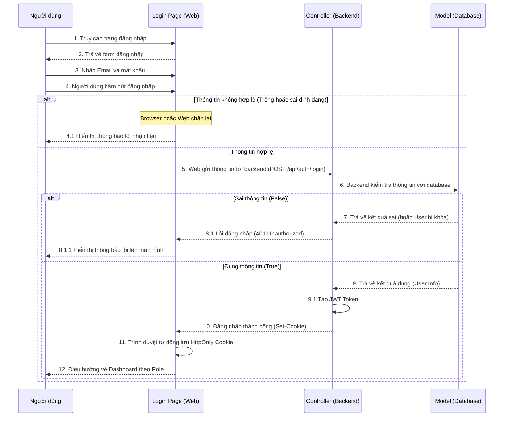
```mermaid
sequenceDiagram
    participant U as Người dùng
    participant W as Login Page (Web)
    participant B as Controller (Backend)
    participant D as Model (Database)

    U->>W: 1. Truy cập trang đăng nhập
    W-->>U: 2. Trả về form đăng nhập
    U->>W: 3. Nhập Email và mật khẩu
    U->>W: 4. Người dùng bấm nút đăng nhập
    
    alt Thông tin không hợp lệ (Trống hoặc sai định dạng)
        Note over W: Browser hoặc Web chặn lại
        W-->>U: 4.1 Hiển thị thông báo lỗi nhập liệu
    else Thông tin hợp lệ
        W->>B: 5. Web gửi thông tin tới backend (POST /api/auth/login)
        B->>D: 6. Backend kiểm tra thông tin với database
        
        alt Sai thông tin (False)
            D-->>B: 7. Trả về kết quả sai (hoặc User bị khóa)
            B-->>W: 8.1 Lỗi đăng nhập (401 Unauthorized)
            W-->>U: 8.1.1 Hiển thị thông báo lỗi lên màn hình
        else Đúng thông tin (True)
            D-->>B: 9. Trả về kết quả đúng (User Info)
            B->>B: 9.1 Tạo JWT Token
            B-->>W: 10. Đăng nhập thành công (Set-Cookie)
            W->>W: 11. Trình duyệt tự động lưu HttpOnly Cookie
            W-->>U: 12. Điều hướng về Dashboard theo Role
        end
    end
```

---

## 2. NHÓM QUẢN LÝ NGƯỜI THUÊ (SUPER ADMIN)

### UC-2.2: Xem thông tin người thuê
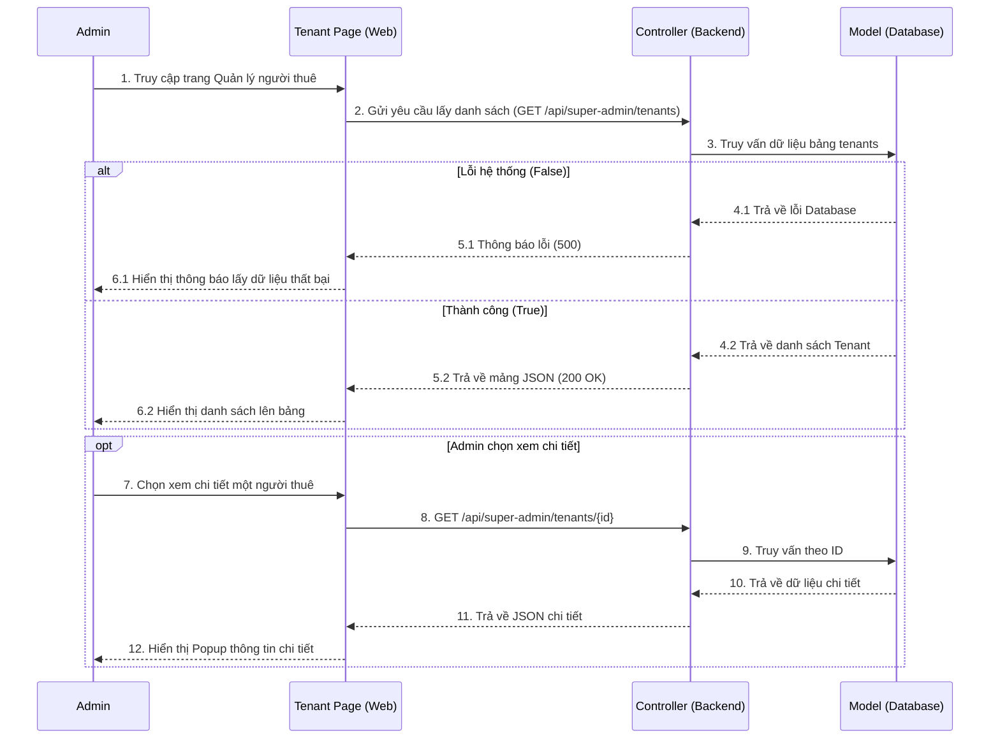
```mermaid
sequenceDiagram
    participant A as Admin
    participant W as Tenant Page (Web)
    participant B as Controller (Backend)
    participant D as Model (Database)

    A->>W: 1. Truy cập trang Quản lý người thuê
    W->>B: 2. Gửi yêu cầu lấy danh sách (GET /api/super-admin/tenants)
    B->>D: 3. Truy vấn dữ liệu bảng tenants

    alt Lỗi hệ thống (False)
        D-->>B: 4.1 Trả về lỗi Database
        B-->>W: 5.1 Thông báo lỗi (500)
        W-->>A: 6.1 Hiển thị thông báo lấy dữ liệu thất bại
    else Thành công (True)
        D-->>B: 4.2 Trả về danh sách Tenant
        B-->>W: 5.2 Trả về mảng JSON (200 OK)
        W-->>A: 6.2 Hiển thị danh sách lên bảng
    end

    opt Admin chọn xem chi tiết
        A->>W: 7. Chọn xem chi tiết một người thuê
        W->>B: 8. GET /api/super-admin/tenants/{id}
        B->>D: 9. Truy vấn theo ID
        D-->>B: 10. Trả về dữ liệu chi tiết
        B-->>W: 11. Trả về JSON chi tiết
        W-->>A: 12. Hiển thị Popup thông tin chi tiết
    end
```

---

### UC-2.3: Thêm người thuê mới
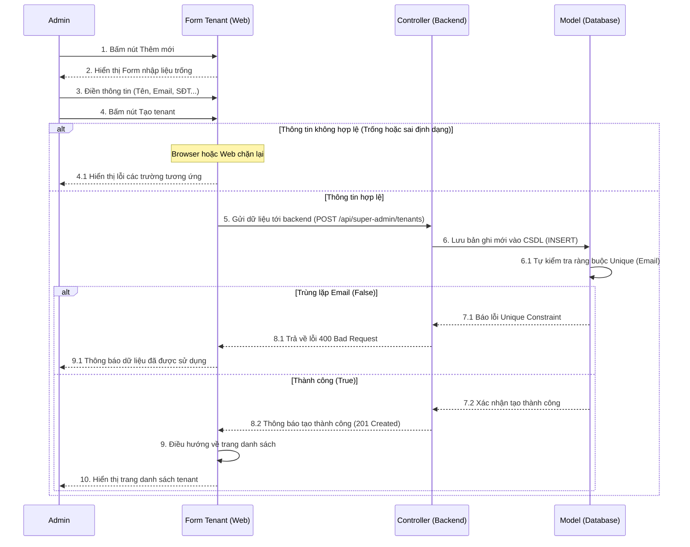
```mermaid
sequenceDiagram
    participant A as Admin
    participant W as Form Tenant (Web)
    participant B as Controller (Backend)
    participant D as Model (Database)

    A->>W: 1. Bấm nút Thêm mới
    W-->>A: 2. Hiển thị Form nhập liệu trống
    A->>W: 3. Điền thông tin (Tên, Email, SĐT...)
    A->>W: 4. Bấm nút Tạo tenant

    alt Thông tin không hợp lệ (Trống hoặc sai định dạng)
        Note over W: Browser hoặc Web chặn lại
        W-->>A: 4.1 Hiển thị lỗi các trường tương ứng
    else Thông tin hợp lệ
        W->>B: 5. Gửi dữ liệu tới backend (POST /api/super-admin/tenants)
        B->>D: 6. Lưu bản ghi mới vào CSDL (INSERT)
        D->>D: 6.1 Tự kiểm tra ràng buộc Unique (Email)

        alt Trùng lặp Email (False)
            D-->>B: 7.1 Báo lỗi Unique Constraint
            B-->>W: 8.1 Trả về lỗi 400 Bad Request
            W-->>A: 9.1 Thông báo dữ liệu đã được sử dụng
        else Thành công (True)
            D-->>B: 7.2 Xác nhận tạo thành công
            B-->>W: 8.2 Thông báo tạo thành công (201 Created)
            W->>W: 9. Điều hướng về trang danh sách
            W-->>A: 10. Hiển thị trang danh sách tenant
        end
    end
```

---

### UC-2.4: Sửa người thuê
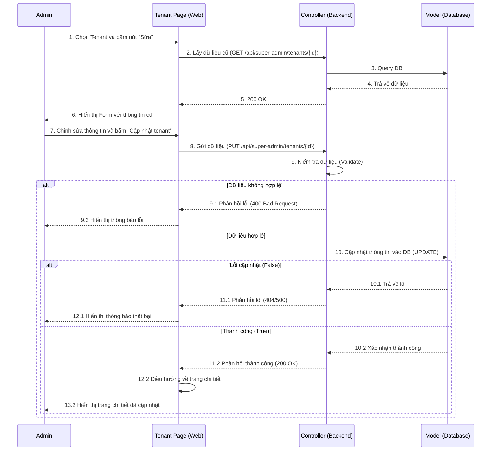
```mermaid
sequenceDiagram
    participant A as Admin
    participant W as Tenant Page (Web)
    participant B as Controller (Backend)
    participant D as Model (Database)

    A->>W: 1. Chọn Tenant và bấm nút "Sửa"
    W->>B: 2. Lấy dữ liệu cũ (GET /api/super-admin/tenants/{id})
    B->>D: 3. Query DB
    D-->>B: 4. Trả về dữ liệu
    B-->>W: 5. 200 OK
    W-->>A: 6. Hiển thị Form với thông tin cũ

    A->>W: 7. Chỉnh sửa thông tin và bấm "Cập nhật tenant"
    W->>B: 8. Gửi dữ liệu (PUT /api/super-admin/tenants/{id})
    B->>B: 9. Kiểm tra dữ liệu (Validate)

    alt Dữ liệu không hợp lệ
        B-->>W: 9.1 Phản hồi lỗi (400 Bad Request)
        W-->>A: 9.2 Hiển thị thông báo lỗi
    else Dữ liệu hợp lệ
        B->>D: 10. Cập nhật thông tin vào DB (UPDATE)

        alt Lỗi cập nhật (False)
            D-->>B: 10.1 Trả về lỗi
            B-->>W: 11.1 Phản hồi lỗi (404/500)
            W-->>A: 12.1 Hiển thị thông báo thất bại
        else Thành công (True)
            D-->>B: 10.2 Xác nhận thành công
            B-->>W: 11.2 Phản hồi thành công (200 OK)
            W->>W: 12.2 Điều hướng về trang chi tiết
            W-->>A: 13.2 Hiển thị trang chi tiết đã cập nhật
        end
    end
```

---

### UC-2.5: Xóa người thuê
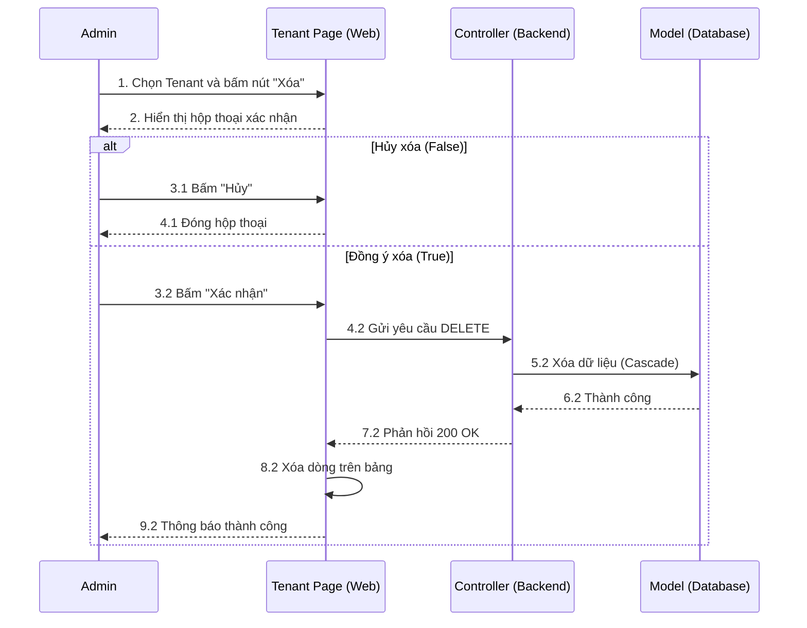
```mermaid
sequenceDiagram
    participant A as Admin
    participant W as Tenant Page (Web)
    participant B as Controller (Backend)
    participant D as Model (Database)

    A->>W: 1. Chọn Tenant và bấm nút "Xóa"
    W-->>A: 2. Hiển thị hộp thoại xác nhận
    
    alt Hủy xóa (False)
        A->>W: 3.1 Bấm "Hủy"
        W-->>A: 4.1 Đóng hộp thoại
    else Đồng ý xóa (True)
        A->>W: 3.2 Bấm "Xác nhận"
        W->>B: 4.2 Gửi yêu cầu DELETE
        B->>D: 5.2 Xóa dữ liệu (Cascade)
        D-->>B: 6.2 Thành công
        B-->>W: 7.2 Phản hồi 200 OK
        W->>W: 8.2 Xóa dòng trên bảng
        W-->>A: 9.2 Thông báo thành công
    end
```

---

### UC-2.6: Tìm kiếm người thuê
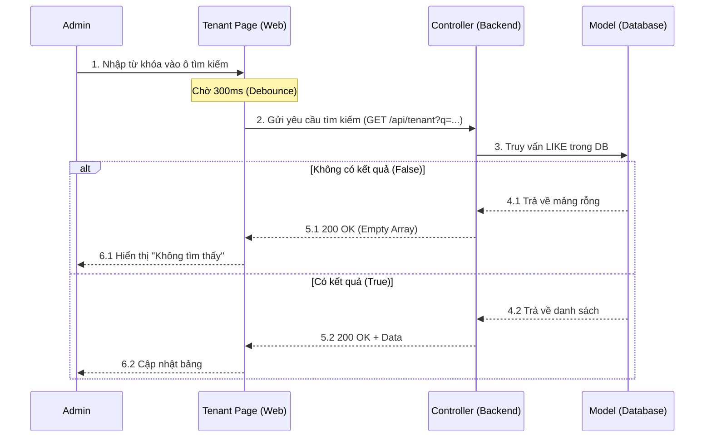
```mermaid
sequenceDiagram
    participant A as Admin
    participant W as Tenant Page (Web)
    participant B as Controller (Backend)
    participant D as Model (Database)

    A->>W: 1. Nhập từ khóa vào ô tìm kiếm
    Note over W: Chờ 300ms (Debounce)
    W->>B: 2. Gửi yêu cầu tìm kiếm (GET /api/tenant?q=...)
    B->>D: 3. Truy vấn LIKE trong DB
    
    alt Không có kết quả (False)
        D-->>B: 4.1 Trả về mảng rỗng
        B-->>W: 5.1 200 OK (Empty Array)
        W-->>A: 6.1 Hiển thị "Không tìm thấy"
    else Có kết quả (True)
        D-->>B: 4.2 Trả về danh sách
        B-->>W: 5.2 200 OK + Data
        W-->>A: 6.2 Cập nhật bảng
    end
```

---

## 3. NHÓM QUẢN LÝ DOANH THU

### UC-3.2: Xem doanh thu
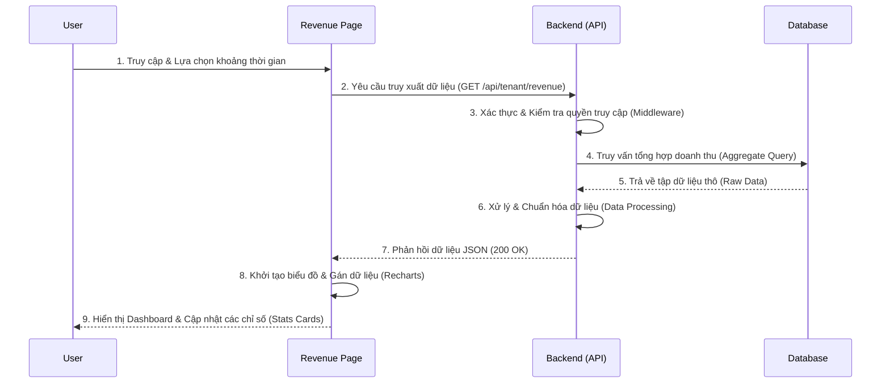
```mermaid
sequenceDiagram
    participant U as User
    participant W as Revenue Page
    participant B as Backend (API)
    participant D as Database

    U->>W: 1. Truy cập & Lựa chọn khoảng thời gian
    W->>B: 2. Yêu cầu truy xuất dữ liệu (GET /api/tenant/revenue)
    B->>B: 3. Xác thực & Kiểm tra quyền truy cập (Middleware)
    
    B->>D: 4. Truy vấn tổng hợp doanh thu (Aggregate Query)
    D-->>B: 5. Trả về tập dữ liệu thô (Raw Data)
    
    B->>B: 6. Xử lý & Chuẩn hóa dữ liệu (Data Processing)
    B-->>W: 7. Phản hồi dữ liệu JSON (200 OK)
    
    W->>W: 8. Khởi tạo biểu đồ & Gán dữ liệu (Recharts)
    W-->>U: 9. Hiển thị Dashboard & Cập nhật các chỉ số (Stats Cards)
```

---

### UC-3.3: Gửi báo cáo doanh thu
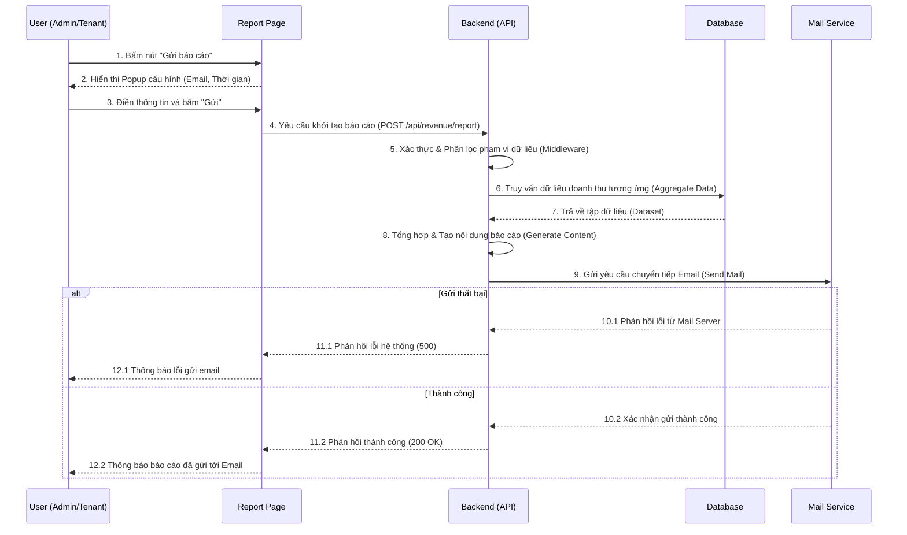
```mermaid
sequenceDiagram
    participant U as User (Admin/Tenant)
    participant W as Report Page
    participant B as Backend (API)
    participant D as Database
    participant M as Mail Service

    U->>W: 1. Bấm nút "Gửi báo cáo"
    W-->>U: 2. Hiển thị Popup cấu hình (Email, Thời gian)
    U->>W: 3. Điền thông tin và bấm "Gửi"
    W->>B: 4. Yêu cầu khởi tạo báo cáo (POST /api/revenue/report)
    
    B->>B: 5. Xác thực & Phân lọc phạm vi dữ liệu (Middleware)
    B->>D: 6. Truy vấn dữ liệu doanh thu tương ứng (Aggregate Data)
    D-->>B: 7. Trả về tập dữ liệu (Dataset)
    
    B->>B: 8. Tổng hợp & Tạo nội dung báo cáo (Generate Content)
    
    B->>M: 9. Gửi yêu cầu chuyển tiếp Email (Send Mail)
    
    alt Gửi thất bại
        M-->>B: 10.1 Phản hồi lỗi từ Mail Server
        B-->>W: 11.1 Phản hồi lỗi hệ thống (500)
        W-->>U: 12.1 Thông báo lỗi gửi email
    else Thành công
        M-->>B: 10.2 Xác nhận gửi thành công
        B-->>W: 11.2 Phản hồi thành công (200 OK)
        W-->>U: 12.2 Thông báo báo cáo đã gửi tới Email
    end
```

### UC-3.4: Xem danh sách giao dịch
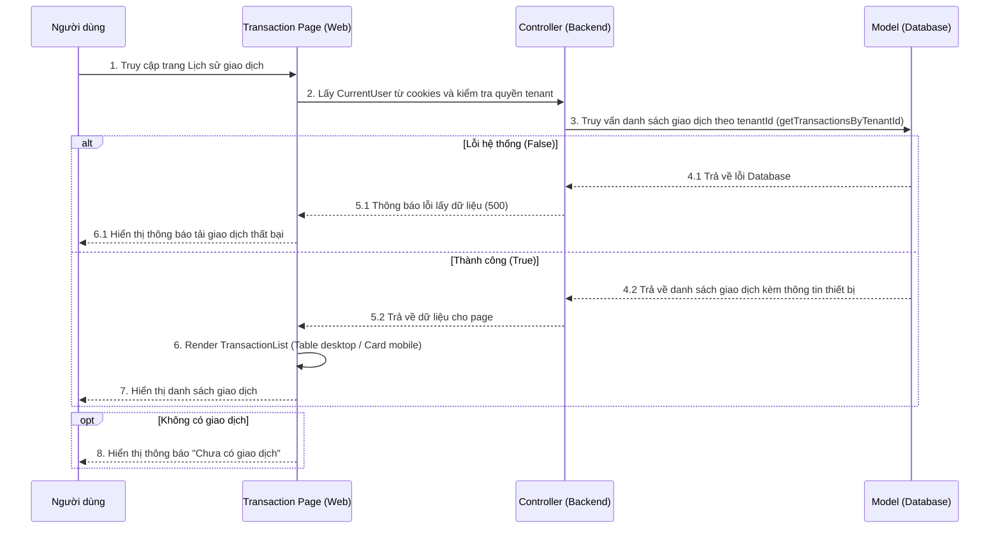
```mermaid
sequenceDiagram
    participant U as Người dùng
    participant W as Transaction Page (Web)
    participant B as Controller (Backend)
    participant D as Model (Database)

    U->>W: 1. Truy cập trang Lịch sử giao dịch
    W->>B: 2. Lấy CurrentUser từ cookies và kiểm tra quyền tenant
    B->>D: 3. Truy vấn danh sách giao dịch theo tenantId (getTransactionsByTenantId)

    alt Lỗi hệ thống (False)
        D-->>B: 4.1 Trả về lỗi Database
        B-->>W: 5.1 Thông báo lỗi lấy dữ liệu (500)
        W-->>U: 6.1 Hiển thị thông báo tải giao dịch thất bại
    else Thành công (True)
        D-->>B: 4.2 Trả về danh sách giao dịch kèm thông tin thiết bị
        B-->>W: 5.2 Trả về dữ liệu cho page
        W->>W: 6. Render TransactionList (Table desktop / Card mobile)
        W-->>U: 7. Hiển thị danh sách giao dịch
    end

    opt Không có giao dịch
        W-->>U: 8. Hiển thị thông báo "Chưa có giao dịch"
    end
```

### UC-3.5: Xuất file thống kê
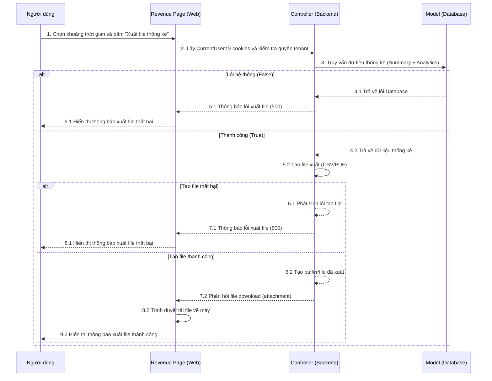
```mermaid
sequenceDiagram
    participant U as Người dùng
    participant W as Revenue Page (Web)
    participant B as Controller (Backend)
    participant D as Model (Database)

    U->>W: 1. Chọn khoảng thời gian và bấm "Xuất file thống kê"
    W->>B: 2. Lấy CurrentUser từ cookies và kiểm tra quyền tenant
    B->>D: 3. Truy vấn dữ liệu thống kê (Summary + Analytics)

    alt Lỗi hệ thống (False)
        D-->>B: 4.1 Trả về lỗi Database
        B-->>W: 5.1 Thông báo lỗi xuất file (500)
        W-->>U: 6.1 Hiển thị thông báo xuất file thất bại
    else Thành công (True)
        D-->>B: 4.2 Trả về dữ liệu thống kê
        B->>B: 5.2 Tạo file xuất (CSV/PDF)

        alt Tạo file thất bại
            B-->>B: 6.1 Phát sinh lỗi tạo file
            B-->>W: 7.1 Thông báo lỗi xuất file (500)
            W-->>U: 8.1 Hiển thị thông báo xuất file thất bại
        else Tạo file thành công
            B-->>B: 6.2 Tạo buffer/file đã xuất
            B-->>W: 7.2 Phản hồi file download (attachment)
            W->>W: 8.2 Trình duyệt tải file về máy
            W-->>U: 9.2 Hiển thị thông báo xuất file thành công
        end
    end
```

---

## 5. NHÓM QUẢN LÝ THIẾT BỊ

### UC-5.2: Xem trạng thái thiết bị
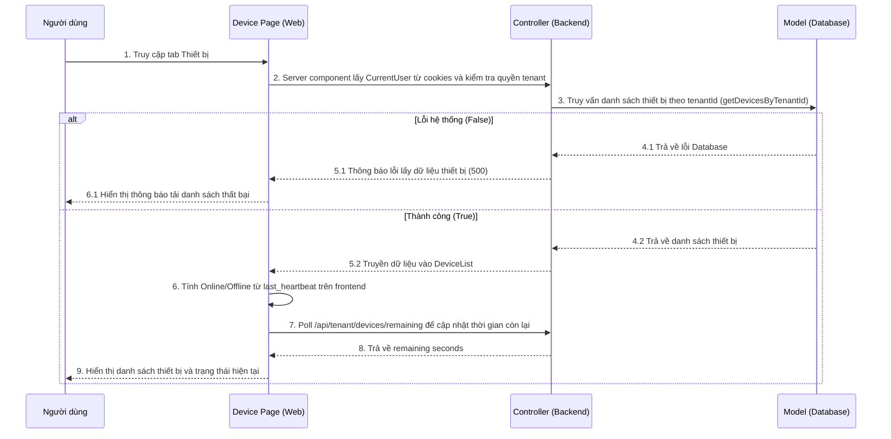
```mermaid
sequenceDiagram
    participant U as Người dùng
    participant W as Device Page (Web)
    participant B as Controller (Backend)
    participant D as Model (Database)

    U->>W: 1. Truy cập tab Thiết bị
    W->>B: 2. Server component lấy CurrentUser từ cookies và kiểm tra quyền tenant
    B->>D: 3. Truy vấn danh sách thiết bị theo tenantId (getDevicesByTenantId)

    alt Lỗi hệ thống (False)
        D-->>B: 4.1 Trả về lỗi Database
        B-->>W: 5.1 Thông báo lỗi lấy dữ liệu thiết bị (500)
        W-->>U: 6.1 Hiển thị thông báo tải danh sách thất bại
    else Thành công (True)
        D-->>B: 4.2 Trả về danh sách thiết bị
        B-->>W: 5.2 Truyền dữ liệu vào DeviceList
        W->>W: 6. Tính Online/Offline từ last_heartbeat trên frontend
        W->>B: 7. Poll /api/tenant/devices/remaining để cập nhật thời gian còn lại
        B-->>W: 8. Trả về remaining seconds
        W-->>U: 9. Hiển thị danh sách thiết bị và trạng thái hiện tại
    end
```

### UC-5.3: Thêm thiết bị
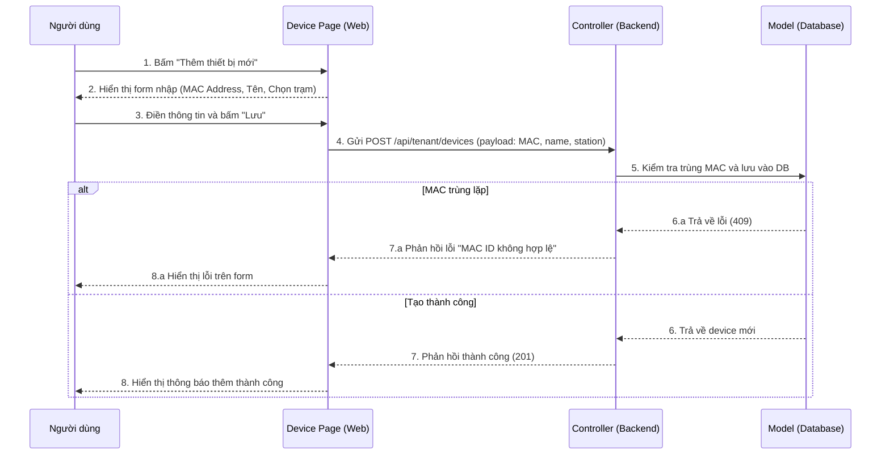
```mermaid
sequenceDiagram
    participant U as Người dùng
    participant W as Device Page (Web)
    participant B as Controller (Backend)
    participant D as Model (Database)

    U->>W: 1. Bấm "Thêm thiết bị mới"
    W-->>U: 2. Hiển thị form nhập (MAC Address, Tên, Chọn trạm)
    U->>W: 3. Điền thông tin và bấm "Lưu"
    W->>B: 4. Gửi POST /api/tenant/devices (payload: MAC, name, station)
    B->>D: 5. Kiểm tra trùng MAC và lưu vào DB

    alt MAC trùng lặp
        D-->>B: 6.a Trả về lỗi (409)
        B-->>W: 7.a Phản hồi lỗi "MAC ID không hợp lệ"
        W-->>U: 8.a Hiển thị lỗi trên form
    else Tạo thành công
        D-->>B: 6. Trả về device mới
        B-->>W: 7. Phản hồi thành công (201)
        W-->>U: 8. Hiển thị thông báo thêm thành công
    end
```

### UC-5.4: Sửa cấu hình thiết bị
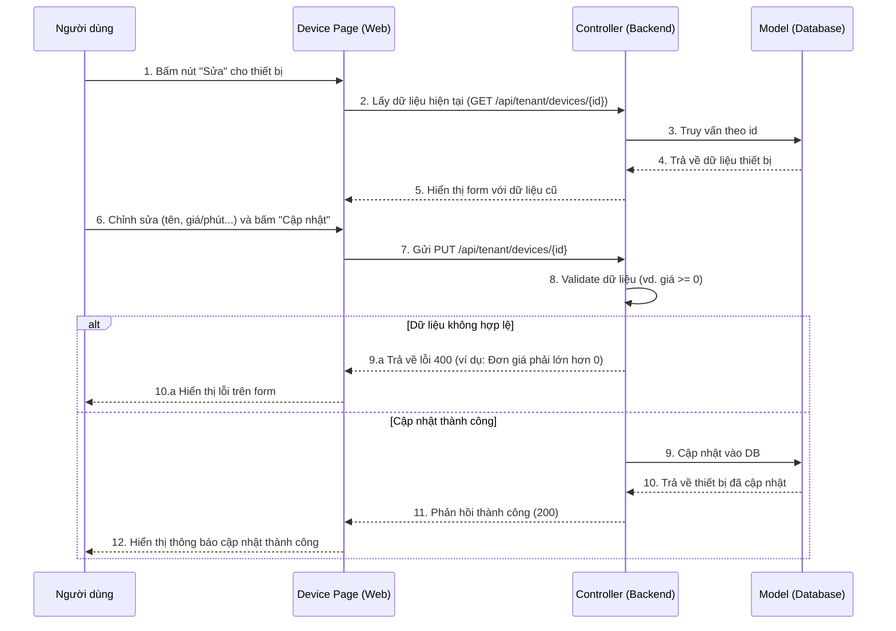
```mermaid
sequenceDiagram
    participant U as Người dùng
    participant W as Device Page (Web)
    participant B as Controller (Backend)
    participant D as Model (Database)

    U->>W: 1. Bấm nút "Sửa" cho thiết bị
    W->>B: 2. Lấy dữ liệu hiện tại (GET /api/tenant/devices/{id})
    B->>D: 3. Truy vấn theo id
    D-->>B: 4. Trả về dữ liệu thiết bị
    B-->>W: 5. Hiển thị form với dữ liệu cũ

    U->>W: 6. Chỉnh sửa (tên, giá/phút...) và bấm "Cập nhật"
    W->>B: 7. Gửi PUT /api/tenant/devices/{id}
    B->>B: 8. Validate dữ liệu (vd. giá >= 0)

    alt Dữ liệu không hợp lệ
        B-->>W: 9.a Trả về lỗi 400 (ví dụ: Đơn giá phải lớn hơn 0)
        W-->>U: 10.a Hiển thị lỗi trên form
    else Cập nhật thành công
        B->>D: 9. Cập nhật vào DB
        D-->>B: 10. Trả về thiết bị đã cập nhật
        B-->>W: 11. Phản hồi thành công (200)
        W-->>U: 12. Hiển thị thông báo cập nhật thành công
    end
```

### UC-5.5: Xóa thiết bị
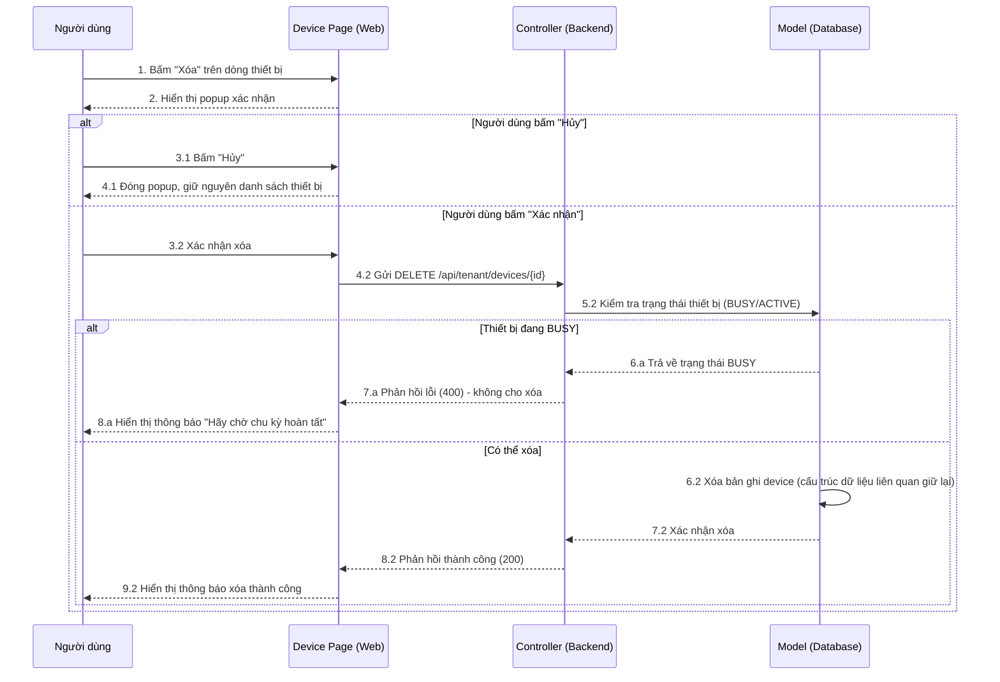
```mermaid
sequenceDiagram
    participant U as Người dùng
    participant W as Device Page (Web)
    participant B as Controller (Backend)
    participant D as Model (Database)

    U->>W: 1. Bấm "Xóa" trên dòng thiết bị
    W-->>U: 2. Hiển thị popup xác nhận
    alt Người dùng bấm "Hủy"
        U->>W: 3.1 Bấm "Hủy"
        W-->>U: 4.1 Đóng popup, giữ nguyên danh sách thiết bị
    else Người dùng bấm "Xác nhận"
        U->>W: 3.2 Xác nhận xóa
        W->>B: 4.2 Gửi DELETE /api/tenant/devices/{id}
        B->>D: 5.2 Kiểm tra trạng thái thiết bị (BUSY/ACTIVE)

        alt Thiết bị đang BUSY
            D-->>B: 6.a Trả về trạng thái BUSY
            B-->>W: 7.a Phản hồi lỗi (400) - không cho xóa
            W-->>U: 8.a Hiển thị thông báo "Hãy chờ chu kỳ hoàn tất"
        else Có thể xóa
            D->>D: 6.2 Xóa bản ghi device (cấu trúc dữ liệu liên quan giữ lại)
            D-->>B: 7.2 Xác nhận xóa
            B-->>W: 8.2 Phản hồi thành công (200)
            W-->>U: 9.2 Hiển thị thông báo xóa thành công
        end
    end
```

---

## 6. NHÓM CHỨC NĂNG KHÁCH HÀNG (USER)

### UC-6.1: Thanh toán và Khởi động máy
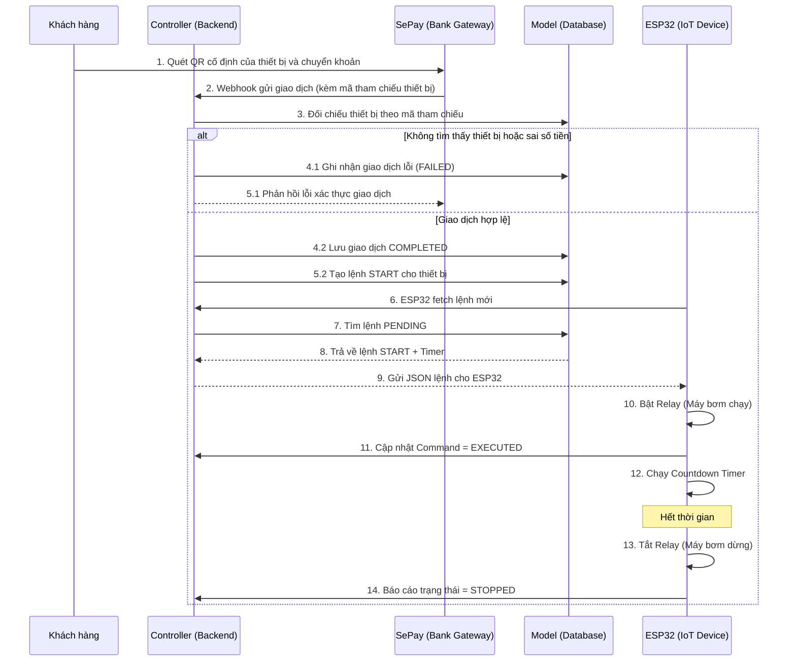
```mermaid
sequenceDiagram
    participant C as Khách hàng
    participant B as Controller (Backend)
    participant SP as SePay (Bank Gateway)
    participant D as Model (Database)
    participant IOT as ESP32 (IoT Device)

    C->>SP: 1. Quét QR cố định của thiết bị và chuyển khoản
    SP->>B: 2. Webhook gửi giao dịch (kèm mã tham chiếu thiết bị)
    B->>D: 3. Đối chiếu thiết bị theo mã tham chiếu

    alt Không tìm thấy thiết bị hoặc sai số tiền
        B->>D: 4.1 Ghi nhận giao dịch lỗi (FAILED)
        B-->>SP: 5.1 Phản hồi lỗi xác thực giao dịch
    else Giao dịch hợp lệ
        B->>D: 4.2 Lưu giao dịch COMPLETED
        B->>D: 5.2 Tạo lệnh START cho thiết bị

        IOT->>B: 6. ESP32 fetch lệnh mới
        B->>D: 7. Tìm lệnh PENDING
        D-->>B: 8. Trả về lệnh START + Timer
        B-->>IOT: 9. Gửi JSON lệnh cho ESP32

        IOT->>IOT: 10. Bật Relay (Máy bơm chạy)
        IOT->>B: 11. Cập nhật Command = EXECUTED

        IOT->>IOT: 12. Chạy Countdown Timer
        Note over IOT: Hết thời gian
        IOT->>IOT: 13. Tắt Relay (Máy bơm dừng)
        IOT->>B: 14. Báo cáo trạng thái = STOPPED
    end
```

---

## 7. NHÓM IOT DEVICE (ESP32)

### UC-7.1: Đăng ký thiết bị (Register)
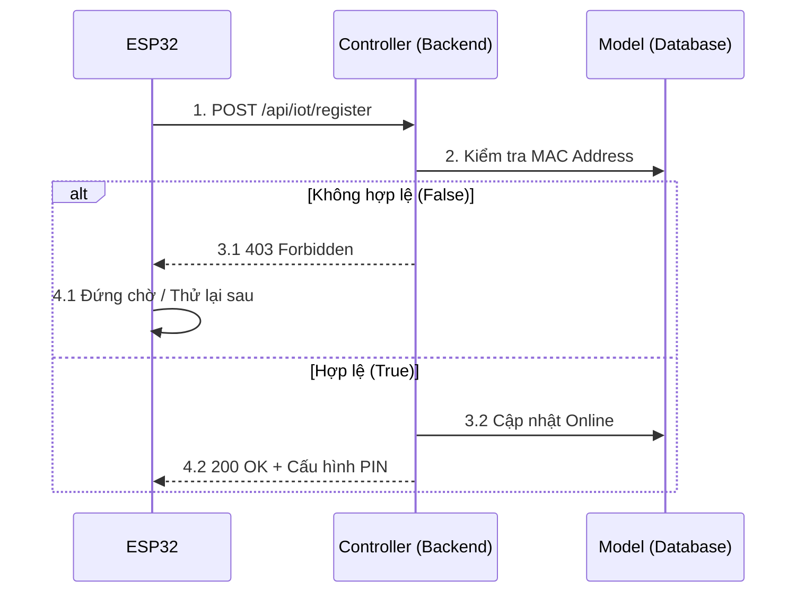
```mermaid
sequenceDiagram
    participant IOT as ESP32
    participant B as Controller (Backend)
    participant D as Model (Database)

    IOT->>B: 1. POST /api/iot/register
    B->>D: 2. Kiểm tra MAC Address
    
    alt Không hợp lệ (False)
        B-->>IOT: 3.1 403 Forbidden
        IOT->>IOT: 4.1 Đứng chờ / Thử lại sau
    else Hợp lệ (True)
        B->>D: 3.2 Cập nhật Online
        B-->>IOT: 4.2 200 OK + Cấu hình PIN
    end
```

### UC-7.2: Heartbeat định kỳ
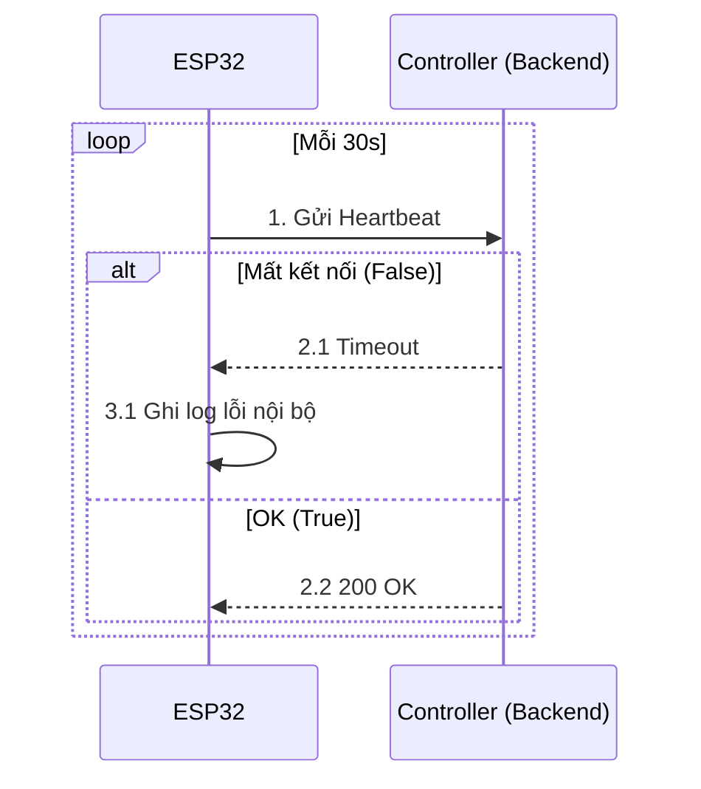
```mermaid
sequenceDiagram
    participant IOT as ESP32
    participant B as Controller (Backend)

    loop Mỗi 30s
        IOT->>B: 1. Gửi Heartbeat
        alt Mất kết nối (False)
            B-->>IOT: 2.1 Timeout
            IOT->>IOT: 3.1 Ghi log lỗi nội bộ
        else OK (True)
            B-->>IOT: 2.2 200 OK
        end
    end
```

### UC-7.3: Nhận lệnh điều khiển
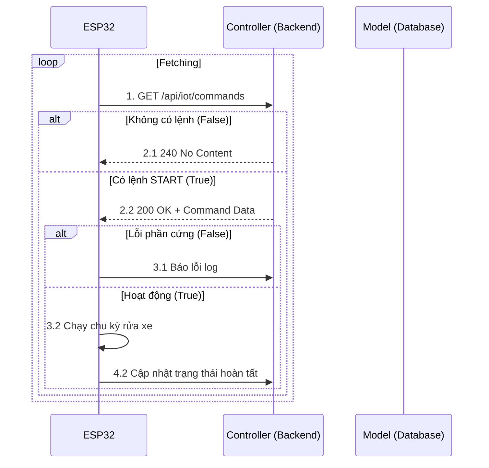
```mermaid
sequenceDiagram
    participant IOT as ESP32
    participant B as Controller (Backend)
    participant D as Model (Database)

    loop Fetching
        IOT->>B: 1. GET /api/iot/commands
        
        alt Không có lệnh (False)
            B-->>IOT: 2.1 240 No Content
        else Có lệnh START (True)
            B-->>IOT: 2.2 200 OK + Command Data
            
            alt Lỗi phần cứng (False)
                IOT->>B: 3.1 Báo lỗi log
            else Hoạt động (True)
                IOT->>IOT: 3.2 Chạy chu kỳ rửa xe
                IOT->>B: 4.2 Cập nhật trạng thái hoàn tất
            end
        end
    end
```